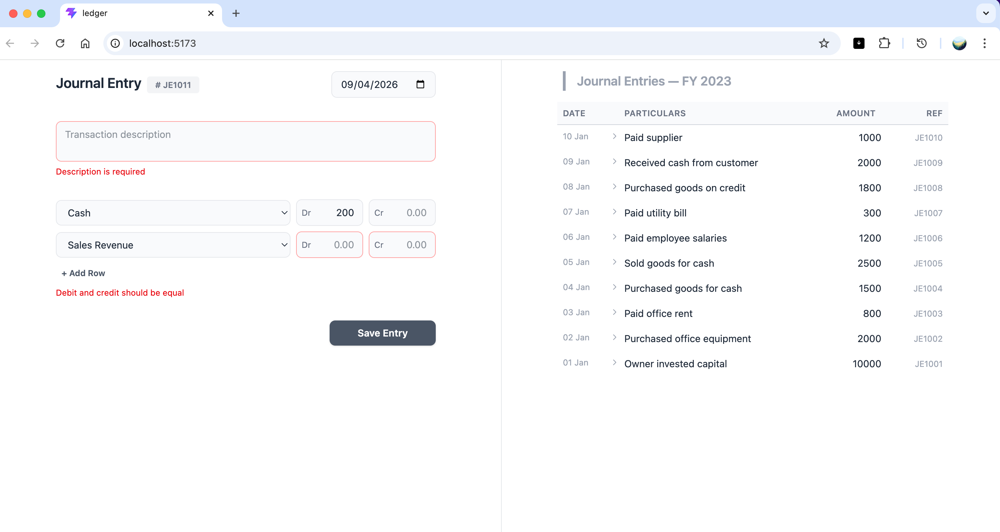

# Ledger

Ledger is a simple accounting web application built with React. It helps users record and manage financial transactions using a clean and intuitive interface.



## Features

* Create journal entries
* Add debit and credit records
* Basic validation for balanced entries
* Clean and responsive UI

## Tech Stack

* React
* Vite
* JavaScript (ES6+)
* CSS

## Getting Started

Clone the repository:

```bash
git clone https://github.com/your-username/ledger.git
cd ledger
```

Install dependencies:

```bash
npm install
```

Run the development server:

```bash
npm run dev
```

## Goal

This project is being built step-by-step to demonstrate core accounting concepts like double-entry bookkeeping along with modern frontend development practices.

---

Feel free to explore and contribute!
